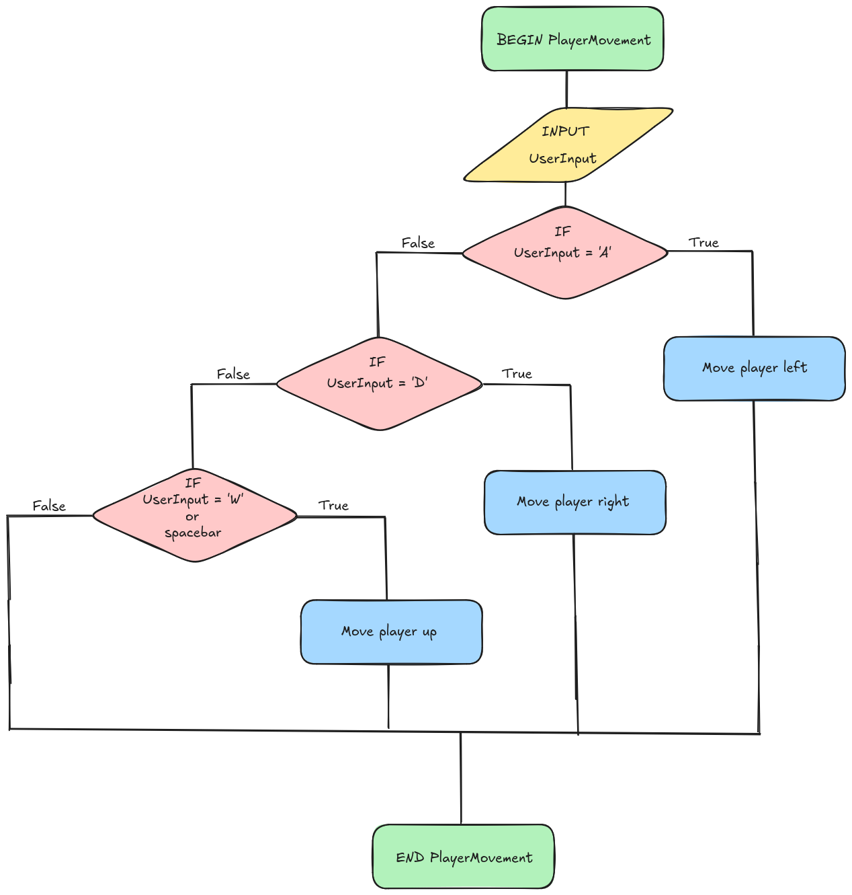
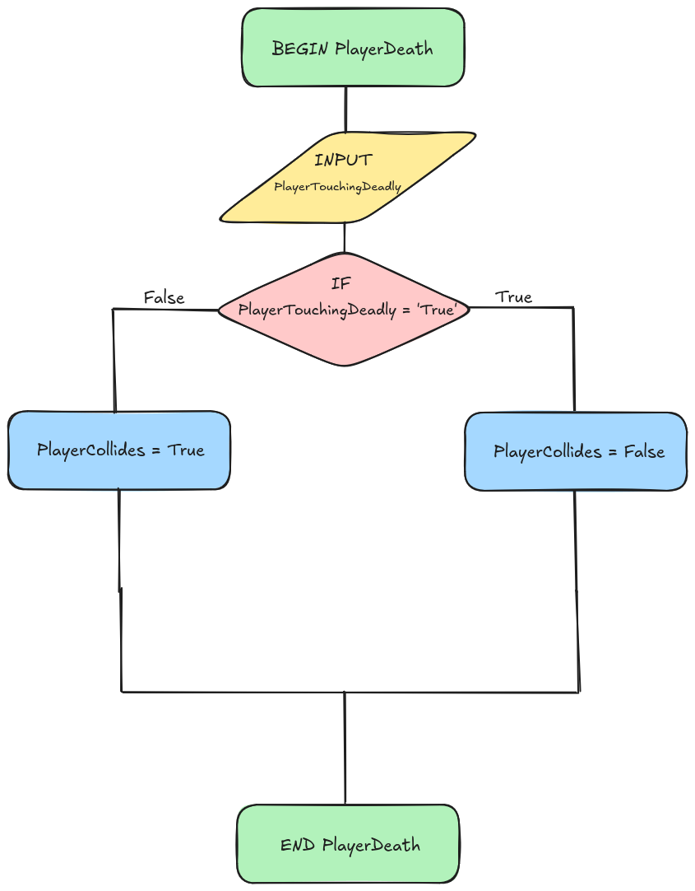
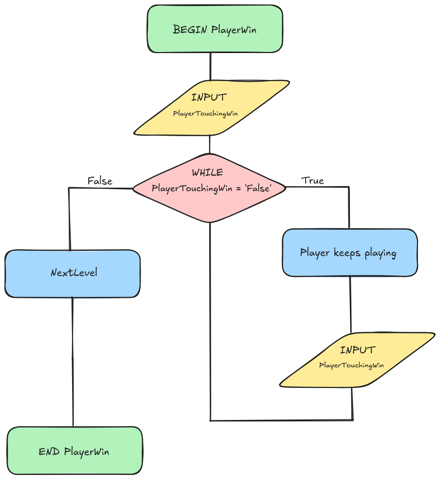
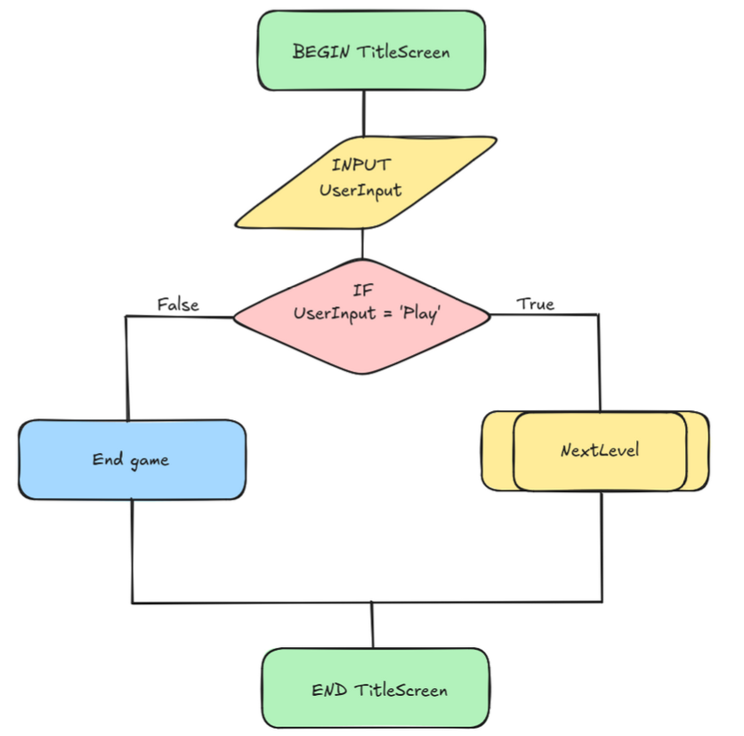

# 9CT Task 4
---
The project I will be working on for the remainder of the term will be a continued version of my game with an improved tilemap, better designed characters, a life system, more collectibles, and more 'worlds'. Furthermore, new kinds of game altering collectibles would be added
## Identifying And Defining
### Identifying A Need
**Need:** Give children entertainment that requires their input and is fun.  
**Problem Statement:**  Having children spend a majority of their time sitting down absorbed in a video is not good for them. They are far better off having to interact with something, make decisions of their own. That's why it's preferred that children play videogames rather than sit there brainlessly absorbed in a screen.  
**Skill Development:** Learn how to create a life system in the game to change difficulty.


## Requirements Outline
### Functional Requirements
- Player Movement: Game will continuously check for player inputs. Once the player inputs a movement key, the game will move the character in a certain direction based on the key pressed.
- Player Death: Game will continuously check if a player has collided with an enemy. Once the player and an enemy collide, the game will kill the player character. The game will then return to the title screen.
- Player Win: Game will continuously check if the player is colliding with a win collectible. If this does occur, the next scene will start, and the player will be put in the next level to play.
- Title Screen: Game will check for a button press. If it is *QUIT GAME* the game will stop running. If the button pressed is *PLAY* the first level will be played


### Non-Functional Requirements
- Better Title Screen: The title screen will have four buttons as opposed to the two in the previous concept. They will be as follows. *PLAY, LEVELS, TUTORIAL, QUIT* Depending on which button is pressed, the player will be sent to different locations. *PLAY* will send the player to the first level, letting them play them all in succession. *LEVELS* will direct the player to another screen containing access to all the levels for them to select. *TUTORIAL* will put the player in an easy practice level for the user to learn the controls. Lastly, *QUIT* will end the game
- Multiple Lives: The user will be able to die more than once. If the player dies, and if they have more than one life remaining, the game will send them back to the start of the level they were up to.
- Tutorial: As mentioned earlier in the non-requirements, there will be a tutorial level to help a new user understand the controls and mechanics of the game.
- New Collectibles: If the player collides with these collectibles, the game will change in some shape or form. Depending on what is achievable in the amount of time, collectibles that control the player's size, jump height, speed etc will be added.


## Social And Ethical Issues
*Equity* - the quality of being fair and just, especially in a way that takes account of and seeks to address existing inequalities.
> Ensuring everyone is treated fairly and there are no imbalances from person to person


*Accessibility* - the quality of being able to be reached or entered. 
> Ensuring something is easily available for people to access and use.


### Accessibility
The controls of the game are quite basic and easy for anyone to learn. Furthermore, there will be a tutorial to help people learn how to play easier.


### Privacy and Data Protection
Since my game won't collect any user data, there are no privacy concerns. However, *if* highscores would be stored and added later on, players would be able to choose whether or not to save a high score.


### Fairness and Representation
It is extremely hard to create something and not have it offend **someone**, but keeping any unfair stereotypes out of the game is a good idea. While the current goal of the game (You are a piece of sushi trying to find the chopsticks and avoid the demon forks) can be seen as offensive, it is all lighthearted and not intended to offend any particular parties. *And if they have a problem with it, they can go find another game to play.*


### Mental and Emotional Well-Being
Ok, so maaaaaaybe the demon forks are a bit evil, but the rest of the game is fun, cartoon-like and a general fun atmosphere. The cute character is lovable and adorable, for anyone.


### Cultural Sensitivities
Ok, again, the aim of the game can be seen as culturally swayed, but it is all in the context of a fun little game. If you have a problem with it, don't play it. It's just a game, it's not the end of the world.

## PMI Table
Pretend there's a screenshot here.

## Researching and Planning
### Flowcharts And Pseudocode

```
BEGIN PlayerMovement
    INPUT UserInput
    IF UserInput = 'A'
        Move player left
    ELSEIF UserInput = 'D'
    Move player right
    ELSEIF UserInput = 'Spacebar' or 'W'
        IF PlayerTouchingGround = True
            Move player up
    ENDIF
END PlayerMovement
```


```
BEGIN PlayerDeath
    INPUT PlayerTouchingDeadly
    IF PlayerTouchingDeadly = True
        PlayerCollides = False
    ELSE
        PlayerCollides = True
END PlayerDeath
```

```
BEGIN PlayerWin
    WHILE PlayerTouchingWin = FALSE
        Player keeps playing
        INPUT PlayerTouchingWin
    NextLevel
END PlayerWin
```

```
BEGIN TitleScreen
    INPUT UserInput
    IF UserInput = 'Play'
        Level1
    ELIF UserInput = 'Quit'
    End Game
END TitleScreen
```


